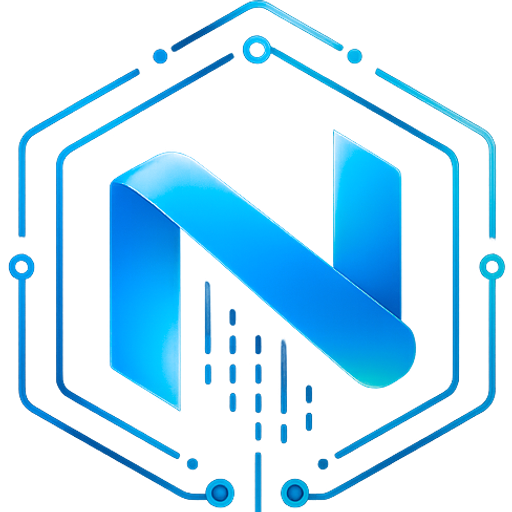

<div align="center">
  
  <h1>Nora</h1>
  <p><strong>The self-hosted AI agent ops platform.</strong></p>
  <p>
    Deploy, monitor, and operate OpenClaw and Hermes runtimes from one operator surface — runtime-neutral, Apache 2.0, and on infrastructure you control. Run agents on Docker or Kubernetes today, use NemoClaw sandboxes experimentally, and track Proxmox as a planned execution target.
  </p>
</div>

<p align="center">
  
  
  
  
  
</p>

<p align="center">
  <a href="https://noradocs.solomontsao.com">📚 Documentation</a> ·
  <a href="https://noradocs.solomontsao.com/quickstart">Quick Start</a> ·
  <a href="https://noradocs.solomontsao.com/self-hosting">Self-Hosting</a> ·
  <a href="https://noradocs.solomontsao.com/concepts/architecture">Architecture</a> ·
  <a href="https://nora.solomontsao.com">Public Site</a> ·
  <a href="https://nora.solomontsao.com/signup">Create Account</a>
</p>

---

<p align="center">
  <a href="https://github.com/solomon2773/nora/raw/master/.github/readme-assets/walkthrough.mp4">
    
  </a>
</p>
<p align="center">
  <sub>▶ <b><a href="https://github.com/solomon2773/nora/raw/master/.github/readme-assets/walkthrough.mp4">Watch the walkthrough</a></b></sub>
</p>

<p align="center">
  
  &nbsp;&nbsp;
  
</p>
<p align="center">
  <sub><b>OpenClaw UI tab</b> &nbsp;·&nbsp; <b>Hermes official dashboard</b></sub>
</p>

## What Is Nora?

Nora is the self-hosted AI agent ops platform for running autonomous agent fleets on infrastructure you control, whether you standardize on OpenClaw, Hermes, or keep both available in the same operator surface.

Most teams running agents in production eventually rebuild the same layer around the runtime itself: deploy workflows, secrets, monitoring, logs, terminal, Agent Hub templating, and a separate admin surface. Nora exists so that layer doesn't have to be rewritten every time the runtime conversation changes.

In one place: deploy OpenClaw and Hermes runtimes, migrate existing runtimes via uploaded bundles or live Docker/SSH inspection, manage provider keys with sync to running runtimes, validate agents through runtime-specific surfaces, browse and edit live runtime files, install Agent Hub starter templates, review monitoring and account event history, and connect channels and integrations from the same control plane. Operator workflows live under `/app`; platform-wide admin lives under `/admin`.

→ [Why Nora](https://noradocs.solomontsao.com/introduction#why-teams-choose-nora) · [Runtime model](https://noradocs.solomontsao.com/concepts/runtimes) · [Deployment footprint](https://noradocs.solomontsao.com/concepts/architecture#deployment-topologies)

## Quick Start

**macOS / Linux / WSL2:**

```bash
curl -fsSL https://raw.githubusercontent.com/solomon2773/nora/master/setup.sh | bash
```

**Windows (PowerShell):**

```powershell
iwr -useb https://raw.githubusercontent.com/solomon2773/nora/master/setup.ps1 | iex
```

> **Windows requires [PowerShell 7+](https://learn.microsoft.com/powershell/scripting/install/installing-powershell-on-windows).** The default Windows PowerShell 5.1 is not supported — run the command above from a `pwsh` 7 session.

The installer verifies prerequisites, generates or preserves secrets, optionally creates a bootstrap admin, picks free local ports when the defaults are busy, and starts the stack. Once it finishes, open the URL printed by setup. Local mode defaults to `http://localhost:8080`, but setup may select another port such as `8081` on a busy workstation. Then follow the [first-15-minutes walkthrough](https://noradocs.solomontsao.com/quickstart).

For manual setup, environment variables, public-domain mode, TLS, Kubernetes, NemoClaw, and planned Proxmox configuration, see the docs:

- [Self-hosting guide](https://noradocs.solomontsao.com/self-hosting)
- [Environment variables reference](https://noradocs.solomontsao.com/configuration/environment-variables)
- [Provisioner backends](https://noradocs.solomontsao.com/configuration/provisioner-backends) (Docker and k3s/Kubernetes are GA; NemoClaw is experimental; Proxmox is planned)
- [TLS and public domains](https://noradocs.solomontsao.com/configuration/tls-domains)
- [Fronting a launch with Cloudflare](infra/cloudflare-launch.md) — edge caching, rate limiting, and spike absorption for the single-host deploy

## Documentation

Full docs live at **[noradocs.solomontsao.com](https://noradocs.solomontsao.com)**. The MDX source is in [`docs/`](./docs).

| Section                                                                        | What's there                                                                                           |
| ------------------------------------------------------------------------------ | ------------------------------------------------------------------------------------------------------ |
| [Quick Start](https://noradocs.solomontsao.com/quickstart)                     | Install and validate your first agent in 15 minutes                                                    |
| [Concepts](https://noradocs.solomontsao.com/concepts/architecture)             | Architecture, agents, runtimes, workspaces, LLM providers, Agent Hub                                   |
| [Configuration](https://noradocs.solomontsao.com/configuration/platform-modes) | Platform modes, env vars, provisioner backends, TLS / public domains                                   |
| [Guides](https://noradocs.solomontsao.com/guides/deploy-agent)                 | Deploy agent, providers, integrations, channels, monitoring, alert rules, backups, Agent Hub, NemoClaw |
| [API Reference](https://noradocs.solomontsao.com/api/overview)                 | Auth, workspaces, agents, channels, integrations, providers, monitoring, alert rules                   |
| [Support](https://noradocs.solomontsao.com/support/faq)                        | FAQ, troubleshooting                                                                                   |

## Architecture

```text
Nginx
├── /           → frontend-marketing  (Next.js)
├── /app/*      → frontend-dashboard  (Next.js)
├── /admin/*    → admin-dashboard     (Next.js)
└── /api/*      → backend-api         (Express.js)
                       ├── PostgreSQL
                       ├── Redis + BullMQ  (deployments, clawhub-installs, backups, alert-deliveries)
                       ├── worker-provisioner
                       ├── worker-backup
                       └── runtime adapters/profiles  (Docker GA · k3s/k8s GA · NemoClaw experimental · Proxmox planned)
```

Full architecture write-up — system map, queue/worker boundaries, RBAC, migration contract, deployment topologies — is in [docs/concepts/architecture](https://noradocs.solomontsao.com/concepts/architecture).

## Tech Stack

| Layer                 | Technology                                                                         |
| --------------------- | ---------------------------------------------------------------------------------- |
| Reverse proxy         | Nginx                                                                              |
| Frontends             | Next.js 16, React 19, Tailwind CSS                                                 |
| Backend API           | Express.js 5, Node.js 24 LTS                                                       |
| Auth                  | JWT, HttpOnly cookies, bcryptjs, provider OAuth bridge                             |
| Database              | PostgreSQL 15                                                                      |
| Queue                 | BullMQ + Redis 7                                                                   |
| Runtime families      | OpenClaw, Hermes                                                                   |
| Provisioning backends | Docker and k3s/Kubernetes (GA); NemoClaw (experimental sandbox); Proxmox (planned) |
| Secrets at rest       | AES-256-GCM (provider keys, integrations, backups)                                 |

## Public REST API and CLI

Workspace-scoped API keys (bearer-only, prefixed `nora_`, HMAC-hashed at rest, scope-based) drive a stable subset of the REST surface. Issue keys at `/app/workspaces/<id>/api-keys`.

```bash
export NORA_TOKEN="nora_..."
curl -H "Authorization: Bearer $NORA_TOKEN" https://your-nora.example.com/api/agents
```

A small CLI lives in [`cli/`](./cli) (`@nora/cli`) and wraps the same surface for `nora workspaces`, `nora agents`, and `nora monitoring`. See the [API reference](https://noradocs.solomontsao.com/api/overview) for the supported endpoints and scopes.

## Roadmap

Current roadmap items:

- **High priority - NemoClaw experimental hardening:** mature the experimental secure-sandbox profile across enablement, NVIDIA key and model configuration, OpenShell policy controls, approvals, gateway health, logs, terminal access, telemetry, and end-to-end validation.
- **Proxmox execution target:** complete the planned LXC deployment path for standard, Hermes, and NemoClaw-backed runtimes, with stronger API/SSH validation, template handling, lifecycle operations, log streaming, telemetry, and smoke coverage.
- **Hermes/OpenClaw parity:** close runtime gaps across validation, deployment readiness, logs, terminal access, monitoring, integration setup, and failure reporting.
- **First-run operator UX:** tighten the setup path for workspaces, LLM providers, provisioning backends, the first agent deploy, and recommended smoke checks.
- **Account-scoped monitoring:** add account-level health views that roll up workspace, agent, runtime, cost, and alert signals with drill-downs where operators need detail.
- **Auth and key-sync hardening:** strengthen session and API-key boundaries, provider key propagation, audit trails, key rotation, and recovery from partial sync failures.
- **Agent Hub ergonomics:** improve template discovery, install/configure flows, version metadata, setup guidance, and post-install validation.

## Development

```bash
# Docker (recommended)
docker compose up -d
docker compose logs -f backend-api

# Tests
cd backend-api && npx jest --no-watchman
cd e2e && npm test
```

Detailed contributor guidance, subtree ownership, and development commands live in [`CLAUDE.md`](./CLAUDE.md). For deeper repo work, read [`CONTRIBUTING.md`](./CONTRIBUTING.md), the root [`AGENTS.md`](./AGENTS.md), and the nearest subtree `AGENTS.md`.

## Contributing

Strong contribution areas: runtime adapter work · operator and admin UX · provisioning and lifecycle orchestration · integrations and channels · test and CI hardening · self-hosted deployment ergonomics.

Typical workflow: fork → branch (`feature/...`) → commit → pull request.

## Community

- [Issues](https://github.com/solomon2773/nora/issues)
- [Discussions](https://github.com/solomon2773/nora/discussions)
- [Hermes Agent](https://github.com/NousResearch/Hermes-Agent)
- [OpenClaw](https://github.com/openclaw/openclaw)

## License

This project is open source under the [Apache License 2.0](./LICENSE).
