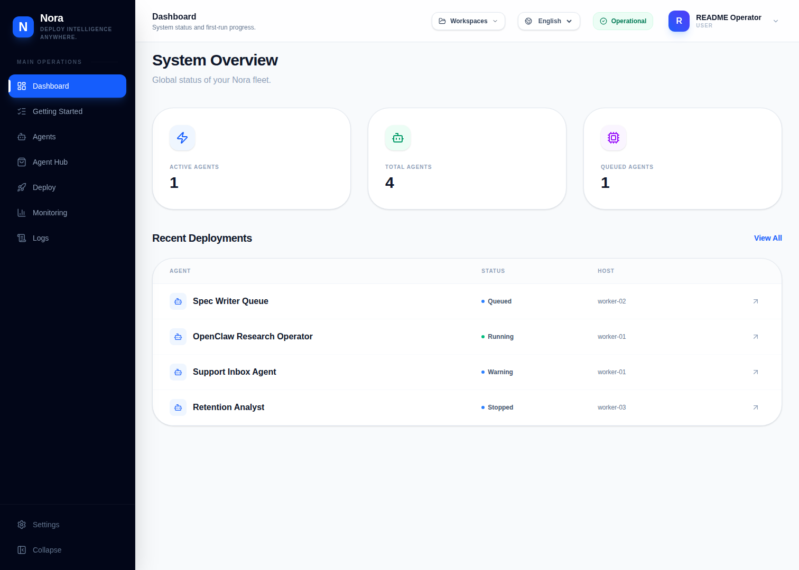
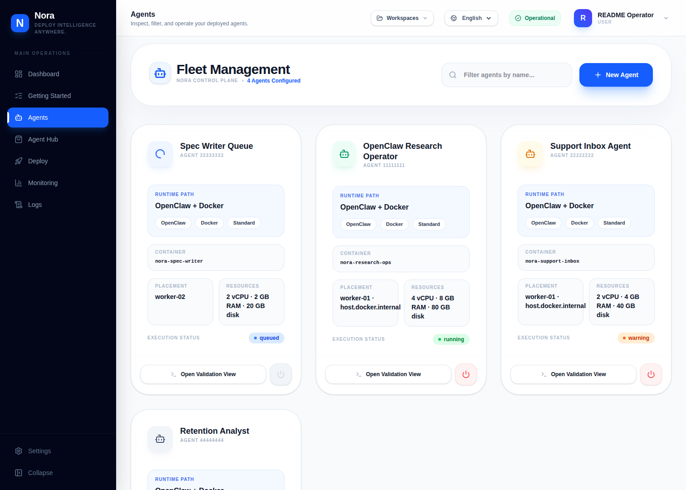
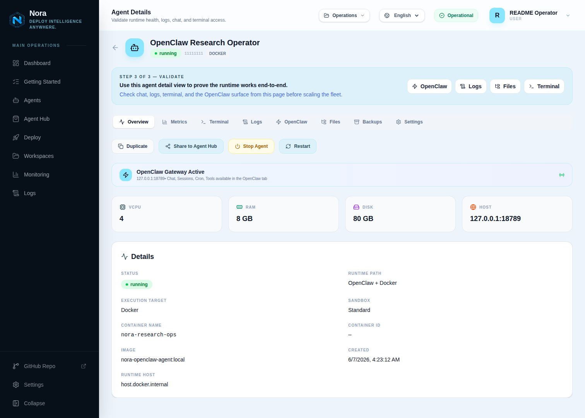
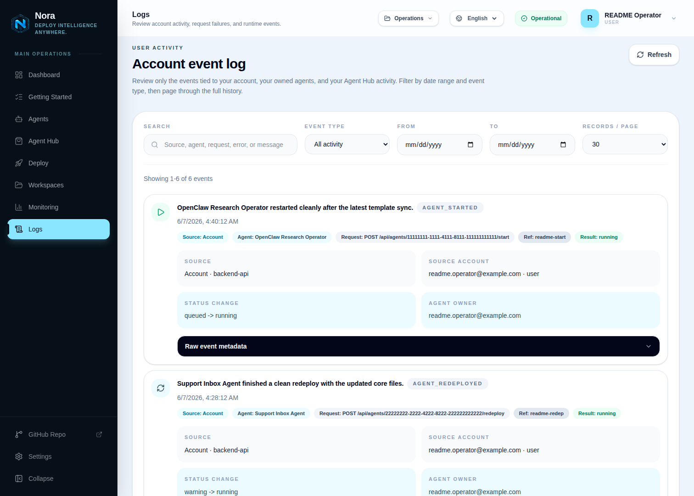
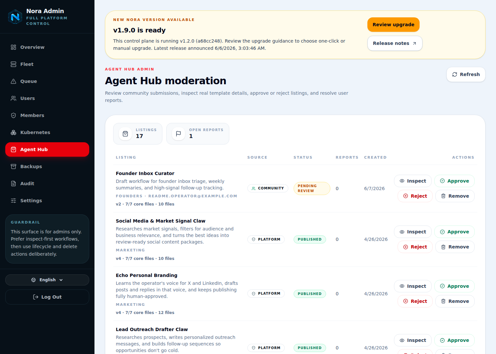
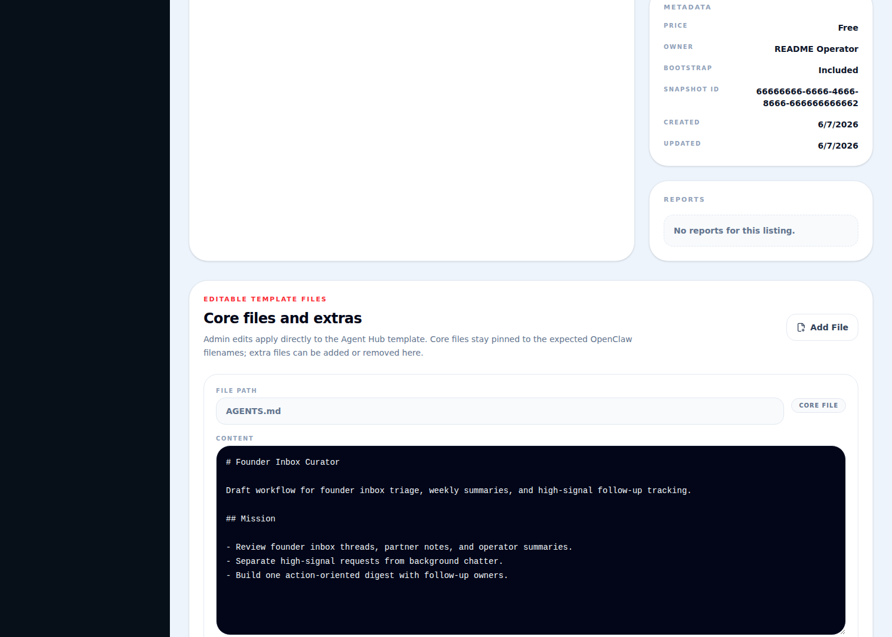

<div align="center">
  <h1>Nora</h1>
  <p><strong>The self-hosted control plane for Hermes and OpenClaw fleets.</strong></p>
  <p>
    Nora is an open-source, runtime-neutral operations platform for autonomous agent fleets. Deploy Hermes and OpenClaw agents from the same surface, keep the control plane on infrastructure you control, and grow from a single Docker host into broader execution targets without replacing your ops layer.
  </p>
</div>

<p align="center">
  
  
  
  
  
</p>

<p align="center">
  <a href="#quick-start">Self-host Quick Start</a> ·
  <a href="https://nora.solomontsao.com">Public Site</a> ·
  <a href="https://nora.solomontsao.com/login">Log In</a> ·
  <a href="https://nora.solomontsao.com/signup">Create Account</a> ·
  <a href="https://nora.solomontsao.com/pricing">Open Source / License / PaaS Mode</a> ·
  <a href="https://github.com/solomon2773/nora">GitHub Repo</a> ·
  <a href="https://raw.githubusercontent.com/solomon2773/nora/master/setup.sh">Install script (bash)</a> ·
  <a href="https://raw.githubusercontent.com/solomon2773/nora/master/setup.ps1">Install script (PowerShell)</a> ·
  <a href="#runtime-model">Runtime model</a> ·
  <a href="#deployment-footprint">Deployment footprint</a>
</p>

---

|                                                                                                          |                                                                                                                               |
| -------------------------------------------------------------------------------------------------------- | ----------------------------------------------------------------------------------------------------------------------------- |
|  **OpenClaw UI tab** |  **Hermes official dashboard** |

## What Is Nora?

Nora is the open-source operations platform for running autonomous agent fleets on infrastructure you control, whether you standardize on OpenClaw, Hermes, or keep both available in the same operator surface.

Most teams running agents in production eventually rebuild the same layer around the runtime itself: deploy workflows, secrets handling, monitoring, logs, terminal access, Agent Hub templating, and a separate admin surface. Nora exists so that layer does not need to be rewritten every time the runtime conversation changes.

Nora gives technical teams one place to:

- deploy OpenClaw and Hermes runtimes into isolated environments
- migrate existing OpenClaw or Hermes runtimes into Nora through uploaded bundles or live Docker/SSH inspection
- manage provider keys and sync them to running runtimes
- validate agents through runtime-specific surfaces, logs, and terminal access
- browse the live runtime filesystem, edit the writable workspace, and export Nora-managed agents as migration bundles
- install built-in starter templates or share Agent Hub listings
- review account-scoped event history and monitoring
- connect channels and integrations from the same control plane
- separate operator workflows under `/app` from platform-wide admin workflows under `/admin`

The core value proposition is simple: if you care about infrastructure ownership, observability, repeatable operations, and avoiding a hard dependency on one runtime family, Nora gets you to a usable control plane faster than rolling your own.

## Why Teams Choose Nora

- **Runtime-neutral by design**. Hermes and OpenClaw are both supported runtime families today, and the platform is structured so additional adapters can be added without rewriting the operator workflow.
- **One operator surface**. Deploy, inspect, restart, monitor, and manage runtime credentials from the same UI instead of stitching separate tools together.
- **Multi-path control plane**. Nora is structured around runtime family, deploy target, and sandbox profile instead of a single launcher, so broader execution paths can evolve without replacing the browser workflow.
- **Security-conscious defaults**. Provider keys are centrally managed, encrypted at rest, and synchronized through runtime-aware control-plane flows.
- **Clear operator/admin split**. Account-scoped operations stay in `/app`; platform-wide moderation, queue inspection, and audit workflows stay in `/admin`.
- **Self-hostable and commercially usable**. The repo, install scripts, and Docker Compose path are public, and Apache 2.0 allows internal commercial use and customer-facing hosted offerings you run yourself.

## Runtime Model

### Hermes And OpenClaw Are Both Supported

Nora supports two runtime families today:

- **OpenClaw**. The default and broadest runtime path in this repo, with the most complete operator contract today.
- **Hermes**. An experimental, Docker-backed runtime family with its own WebUI, provider and integration env sync, logs, and terminal workflows under the same Nora control plane.

The important product boundary is that Nora keeps the control plane centered on operator workflows, not on a single runtime brand. OpenClaw is still the default path today, but Hermes is not bolted on as a separate product.

### Runtime-Friendly Architecture

Runtime abstractions stay clean so teams can evolve the runtime layer without rebuilding the operator surface:

- runtime-specific adapters are isolated behind shared contracts in `agent-runtime/`
- the operator UI stays centered on deployment, inspection, and lifecycle work
- backend selection remains explicit through runtime family, deploy target, and sandbox profile
- infrastructure ownership stays with the operator regardless of which runtime family is enabled

### Current Path Maturity

The public repo does not present every runtime path at the same maturity. The current backend catalog breaks down like this:

| Path                          | Status       | Notes                                                                                                    |
| ----------------------------- | ------------ | -------------------------------------------------------------------------------------------------------- |
| **OpenClaw + Docker**         | GA           | Default self-hosted path and broadest operator contract                                                  |
| **OpenClaw + K3s/Kubernetes** | Beta         | Shared-cluster placement through a configured Kubernetes-compatible API instead of the local Docker host |
| **OpenClaw + NemoClaw**       | Experimental | NVIDIA secure sandbox path with stricter isolation on Docker, K3s/Kubernetes, or Proxmox                 |
| **Hermes + Docker**           | Experimental | Deployment-first Hermes contract with WebUI, logs, exec, and env sync                                    |
| **OpenClaw + Proxmox**        | Beta         | LXC placement through configured Proxmox API and SSH bootstrap                                           |

### Runtime Transitions

Nora is designed so teams can run OpenClaw and Hermes side by side without rebuilding the control plane around a single runtime bet.

The public repo now includes a shipped migration path for both runtime families:

- import an existing runtime through an uploaded Nora migration bundle or a live Docker / SSH inspection
- recreate the imported runtime as a new Nora-managed agent instead of adopting the old runtime in place
- export Nora-managed agents back into a reusable migration bundle for recreation on another Nora control plane

The current public contract is intentionally explicit. Nora imports supported files, managed state, and runtime configuration it understands, then recreates that workload under Nora control.

## Deployment Footprint

Nora is built to grow with infrastructure requirements, but the public repo does not present every execution path at the same maturity. The practical footprint today looks like this:

| Path                                              | Current status     | Best fit                                                                                 |
| ------------------------------------------------- | ------------------ | ---------------------------------------------------------------------------------------- |
| **Single-host Nora + OpenClaw Docker**            | GA                 | Evaluation, smaller internal environments, and the clearest first production path        |
| **Nora control plane on public cloud or on-prem** | Supported topology | Teams placing the control plane inside infrastructure they already manage                |
| **Nora + OpenClaw K3s/Kubernetes**                | Beta               | Shared-cluster environments with configured Kubernetes-compatible API access             |
| **Nora + OpenClaw NemoClaw**                      | Experimental       | Stronger sandboxing with NVIDIA/OpenShell policy controls on supported execution targets |
| **Nora + Hermes Docker**                          | Experimental       | Teams validating Hermes under Nora's deployment-first contract                           |
| **Nora + OpenClaw Proxmox**                       | Beta               | Proxmox-backed LXC environments with API credentials and SSH bootstrap configured        |

That footprint matters because Nora is not just a single-agent launcher. It is an operator surface that starts small and stays useful as the infrastructure underneath it gets more serious.

## Who Nora Is For

Nora is best for:

- internal AI platform teams standardizing on an agent ops layer
- technical product teams running OpenClaw, Hermes, or both in production
- ops-minded builders who want runtime infrastructure under explicit control
- service providers hosting and operating agent control planes for customers on infrastructure they own

Nora is not trying to be:

- a vague "AI workforce" wrapper
- a low-code automation toy
- a permanently single-runtime dashboard

## Open Source Means Open Source

Nora is licensed under Apache 2.0. That means you can:

- self-host Nora on infrastructure you control
- modify the codebase for your own needs
- use Nora commercially inside your own company
- host Nora for clients or customers on infrastructure you operate
- build services, packaging, or integrations on top of the platform

The product story is centered on the open repo and the self-hosted trust path first. Teams should be able to inspect the install flow, architecture, and runtime boundaries before they decide whether Nora fits their internal operations.

## Product Tour

Screenshots below were captured from the current local Nora stack and reflect the operator and admin surfaces in this repository.

### Operator Workspace

|                                                                                                                       |                                                                                                        |
| --------------------------------------------------------------------------------------------------------------------- | ------------------------------------------------------------------------------------------------------ |
|  **System overview**                            |  **Fleet management**               |
|  **Deploy flow**                                  |  **Agent detail**                |
|  **Provider setup**                |  **Agent Hub browse**           |
|  **Agent Hub template detail** |  **Account event log** |

### Admin Workspace

|                                                                                                   |                                                                                                            |
| ------------------------------------------------------------------------------------------------- | ---------------------------------------------------------------------------------------------------------- |
|  **Agent Hub moderation** |  **Admin template editor** |

## Open-Source Usage Paths

The public story stays simple: Nora is open source first, and teams should understand how to run it themselves before anything else.

1. **Self-hosted open source**. Start with the repo, raw install scripts, and Docker Compose path when you want the clearest self-hosted launch path and full infrastructure control.
2. **PaaS mode you run**. Use `PLATFORM_MODE=paas` when you want to operate Nora as your own hosted product or internal platform. Billing, plans, customer onboarding, infrastructure, and support remain under your control.
3. **Public browser entry**. Use `nora.solomontsao.com`, `/login`, `/signup`, and `/pricing` when you want a fast browser entry or a public reference deployment.
4. **Build on top of Nora**. Apache 2.0 allows packaging, hosted offerings, and custom integrations built on top of the repo.

## Quick Start

### Prerequisites

- macOS 12+, Linux (Ubuntu 20.04+, Debian 11+, Fedora 38+), or Windows 10+ with WSL2 / PowerShell support
- admin or `sudo` access for the initial install
- Docker Desktop or Docker Engine access on the host

### Recommended Install

**macOS / Linux / WSL2**

```bash
curl -fsSL https://raw.githubusercontent.com/solomon2773/nora/master/setup.sh | bash
```

**Windows (PowerShell)**

```powershell
iwr -useb https://raw.githubusercontent.com/solomon2773/nora/master/setup.ps1 | iex
```

The installer can:

- verify or install host prerequisites such as Git, Docker, Docker Compose, and OpenSSL depending on platform
- clone the repository if you launched the installer outside the repo
- update an existing install without deleting `.env`, PostgreSQL data, backup volumes, or provisioned agent instances
- generate platform secrets, Agent Hub hashing material, and database credentials
- create a timestamped `.env` backup before overwriting an existing installer-generated config
- run an explicit clean reinstall when you want to remove local compose data and local Nora agent containers
- choose local-only or public-domain access mode
- configure `PLATFORM_MODE=selfhosted` or `PLATFORM_MODE=paas`
- enable OpenClaw, Hermes, or both runtime families plus matching deploy backends
- optionally configure the bootstrap admin account
- optionally configure Google and GitHub OAuth
- generate the matching nginx configuration and start the Nora stack

LLM provider keys are still added from **Settings** after login, which keeps the install flow straightforward and the operator workflow explicit.

### Updating an Existing Install

Use update mode for normal code updates. It preserves `.env`, the Compose PostgreSQL volume, the backup volume, and provisioned agent instances. If `NORA_AGENT_HUB_API_KEY_HASH_SECRET` is missing or empty, update mode backfills it without rotating an existing non-empty value:

```bash
./setup.sh --update
```

```powershell
.\setup.ps1 -Update
```

Admin Settings can also start a direct GitHub upgrade in the background when `NORA_AUTO_UPGRADE_ENABLED=true` and `NORA_HOST_REPO_DIR` points at the absolute Linux host path for this Nora checkout. The one-click path starts a temporary Docker runner, fetches from `NORA_UPGRADE_REPO`, rebuilds with Docker Compose, and preserves volumes and provisioned instances. The manual host command remains available for installs that do not enable one-click upgrades.

Do not use `docker compose down -v` for routine updates; `-v` removes named volumes such as the PostgreSQL data volume. When you intentionally want a clean local reset, use the clean reinstall mode instead:

```bash
./setup.sh --clean-reinstall
```

```powershell
.\setup.ps1 -CleanReinstall
```

Clean reinstall removes local Compose containers/volumes and local Nora agent containers labeled by Nora. It does not tear down external Kubernetes, Proxmox, NemoClaw, or VM resources.

### Manual Setup

```bash
git clone https://github.com/solomon2773/nora.git
cd nora
bash setup.sh
```

Or configure it by hand:

```bash
cp .env.example .env
```

Then edit `.env` with at least the required secrets, database password, access URL, and runtime selection:

```env
# Required secrets
JWT_SECRET=<replace-with-random-secret-min-32-chars>
ENCRYPTION_KEY=<replace-with-64-hex-chars>
NORA_AGENT_HUB_API_KEY_HASH_SECRET=<replace-with-random-secret-min-32-chars>
DB_PASSWORD=<replace-with-db-password>

# Access / URL
NGINX_CONFIG_FILE=nginx.conf
NGINX_HTTP_PORT=8080
NEXTAUTH_URL=http://localhost:8080
CORS_ORIGINS=http://localhost:8080

# Runtime families and deploy backends
ENABLED_RUNTIME_FAMILIES=openclaw,hermes
ENABLED_BACKENDS=docker
# K3s cluster mode: ENABLED_BACKENDS=docker,k3s
# Managed/upstream Kubernetes: ENABLED_BACKENDS=docker,k8s
ENABLED_SANDBOX_PROFILES=standard

# Optional bootstrap admin
DEFAULT_ADMIN_EMAIL=admin@example.com
DEFAULT_ADMIN_PASSWORD=change-this-to-a-strong-password

# Optional OAuth
OAUTH_LOGIN_ENABLED=false
NEXT_PUBLIC_OAUTH_LOGIN_ENABLED=false
GOOGLE_CLIENT_ID=
GOOGLE_CLIENT_SECRET=
GITHUB_CLIENT_ID=
GITHUB_CLIENT_SECRET=

# Optional Stripe billing for your own PaaS deployment
PLATFORM_MODE=selfhosted
STRIPE_SECRET_KEY=
STRIPE_PRICE_PRO=
STRIPE_PRICE_ENTERPRISE=
```

Leave the Docker Compose defaults from `.env.example` for `DB_HOST`, `DB_USER`, `DB_NAME`, `DB_PORT`, `REDIS_HOST`, `REDIS_PORT`, and `PORT` unless you are wiring Nora to external services.

If you are self-hosting on a public domain, switch to the public nginx path and your own hostname:

```env
NGINX_CONFIG_FILE=nginx.public.conf
NGINX_HTTP_PORT=80
NEXTAUTH_URL=https://your-domain.example
CORS_ORIGINS=https://your-domain.example
```

Create `nginx.public.conf` from `infra/nginx_public.conf.template` for plain HTTP public-domain mode. If Nora should terminate TLS directly on the host, run:

```bash
DOMAIN=your-domain.example EMAIL=admin@example.com ./infra/setup-tls.sh
```

Then start the stack:

```bash
docker compose up -d
```

### First 15 Minutes With Nora

1. **Open the dashboard**

   Local mode defaults:

   | URL                                   | What                    |
   | ------------------------------------- | ----------------------- |
   | `http://localhost:8080`               | Marketing / entry page  |
   | `http://localhost:8080/login`         | Login                   |
   | `http://localhost:8080/signup`        | Create operator account |
   | `http://localhost:8080/app/dashboard` | System overview         |
   | `http://localhost:8080/app/deploy`    | Deploy your first agent |

2. **Add an LLM provider**

   Go to **Settings** and save a supported provider key or compatible endpoint configuration.

3. **Deploy your first agent**
   - open **Deploy**
   - choose **Blank Deploy** for a fresh agent or **Migrate Existing** for an imported runtime
   - choose a runtime family
   - choose the deployment backend or execution path
   - set CPU, RAM, and disk
   - deploy the agent

4. **Validate the runtime**

   After deployment:
   - open the agent detail page
   - verify the agent is running
   - test the runtime-specific surface such as the OpenClaw UI or Hermes WebUI
   - inspect the **Files** tab to browse the live runtime filesystem
   - inspect **Logs**
   - open **Terminal**

   OpenClaw and Hermes do not expose exactly the same runtime contract, but both are visible from the same Nora control plane.

5. **Browse Agent Hub**

   Once one agent is healthy:
   - open **Agent Hub**
   - inspect a built-in starter template or published listing
   - install a listing as a new agent
   - share a reusable agent configuration internally or with the hosted Nora community catalog when appropriate

## What You Can Do In Nora

### Deploy And Manage Agents

Create agents on supported runtime families, choose the deploy backend, define resource limits, and manage lifecycle operations from the dashboard.

### Migrate Existing OpenClaw And Hermes Runtimes

Use the deploy flow to inspect an existing runtime through bundle upload or live Docker / SSH access, preview what Nora can import, and recreate that runtime as a Nora-managed agent.

### Runtime Validation, Logs, And Terminal

Use Nora as the control plane around the runtime: OpenClaw gateway-oriented flows, Hermes WebUI, live logs, and terminal access all stay under the same operator surface.

### Browse Live Files And Export Nora Bundles

Use the Files tab to work against the actual runtime filesystem with a writable workspace and curated read-only system roots, then export a Nora-managed agent as a migration bundle when you need to recreate it elsewhere.

### Manage Provider Keys, Channels, And Integrations

Store provider credentials centrally, sync them to running runtimes, configure channels, and browse integration options without leaving the control plane.

### Install Platform Presets And Share Agent Templates

Browse built-in starter templates, install Agent Hub listings as new agents, and share reusable agent setups internally or with the hosted Nora community catalog from the operator UI.

### Review Account Activity And Monitoring

Users see their own agents, installs, submissions, monitoring data, and related runtime events. Admins get platform-wide fleet, moderation, queue, and audit views.

### Run Admin Operations

Admins get separate platform-wide views for Agent Hub moderation, listing detail, fleet operations, and settings changes that should not live in the operator workspace.

## Architecture

```text
Nginx
├── /           → frontend-marketing  (Next.js)
├── /app/*      → frontend-dashboard  (Next.js)
├── /admin/*    → admin-dashboard     (Next.js)
└── /api/*      → backend-api         (Express.js)
                       ├── PostgreSQL
                       ├── Redis + BullMQ
                       ├── worker-provisioner
                       └── runtime adapters
```

The canonical public architecture write-up lives in [architecture.md](architecture.md).

### Core Components

- `frontend-marketing/` — landing page, login, signup, and the public OSS / license / PaaS explanation
- `frontend-dashboard/` — operator dashboard for agents, migration/import, live filesystem access, Agent Hub, logs, monitoring, settings, and runtime interaction
- `admin-dashboard/` — admin surfaces for fleet, queue, audit, users, and Agent Hub moderation
- `backend-api/` — auth, provisioning, migration draft import/export, live filesystem routes, key management, monitoring, Agent Hub logic, runtime coordination, and proxy routes
- `agent-runtime/` — shared runtime contracts, endpoint conventions, bootstrap files, and backend catalog metadata
- `workers/provisioner/` — deployment workers for Docker, K3s/Kubernetes, and Proxmox execution targets, with runtime-specific Docker adapters where needed
- `e2e/` — Playwright end-to-end and smoke coverage
- `infra/` — TLS, backup, and deployment-adjacent helpers

## Tech Stack

| Layer                 | Technology                                             |
| --------------------- | ------------------------------------------------------ |
| Reverse proxy         | Nginx                                                  |
| Frontends             | Next.js 16, React 19, Tailwind CSS                     |
| Backend API           | Express.js 4, Node.js 24 LTS                           |
| Auth                  | JWT, HttpOnly cookies, bcryptjs, provider OAuth bridge |
| Database              | PostgreSQL 15                                          |
| Queue                 | BullMQ + Redis 7                                       |
| Runtime families      | OpenClaw, Hermes                                       |
| Provisioning backends | Docker, K3s/Kubernetes, Proxmox, NemoClaw              |
| Secrets at rest       | AES-256-GCM                                            |

## Configuration

### Core Variables

| Variable                             | Required | Description                                                                                                                                                                                                                                              |
| ------------------------------------ | -------- | -------------------------------------------------------------------------------------------------------------------------------------------------------------------------------------------------------------------------------------------------------- |
| `JWT_SECRET`                         | Yes      | Secret used to sign JWTs                                                                                                                                                                                                                                 |
| `ENCRYPTION_KEY`                     | Yes      | 64-char hex key for AES-256-GCM secret storage                                                                                                                                                                                                           |
| `NEXTAUTH_URL`                       | Yes      | Public base browser URL such as `http://localhost:8080` or `https://your-domain.example`                                                                                                                                                                 |
| `NGINX_CONFIG_FILE`                  | No       | `nginx.conf` for local mode or `nginx.public.conf` for public-domain mode                                                                                                                                                                                |
| `NGINX_HTTP_PORT`                    | No       | Host port for nginx in HTTP mode                                                                                                                                                                                                                         |
| `PLATFORM_MODE`                      | No       | `selfhosted` or `paas`                                                                                                                                                                                                                                   |
| `ENABLED_RUNTIME_FAMILIES`           | No       | Comma-separated runtime families. Supported values: `openclaw`, `hermes`                                                                                                                                                                                 |
| `ENABLED_BACKENDS`                   | No       | Comma-separated execution target ids. Supported values: `docker`, `k3s`, `k8s`, `proxmox`. Use `k3s` by default for the Kubernetes-compatible path; switch to `k8s` for upstream Kubernetes, AKS, GKE, or EKS. Both ids use the same adapter internally. |
| `ENABLED_SANDBOX_PROFILES`           | No       | Comma-separated sandbox profile ids. Supported values: `standard`, `nemoclaw`                                                                                                                                                                            |
| `CORS_ORIGINS`                       | No       | Comma-separated allowed browser origins                                                                                                                                                                                                                  |
| `DEFAULT_ADMIN_EMAIL`                | No       | Bootstrap admin seeded on first boot when paired with a strong password                                                                                                                                                                                  |
| `DEFAULT_ADMIN_PASSWORD`             | No       | Bootstrap admin password used on first boot only                                                                                                                                                                                                         |
| `NORA_AGENT_HUB_API_KEY_HASH_SECRET` | No       | Dedicated HMAC secret for Agent Hub installation key digests. Setup and update generate it when missing or empty; existing non-empty values are preserved.                                                                                               |

### Backend-Specific Variables

| Variable                                                                     | Description                                                                                                                                           |
| ---------------------------------------------------------------------------- | ----------------------------------------------------------------------------------------------------------------------------------------------------- |
| `K8S_EXPOSURE_MODE`                                                          | `cluster-ip` by default, `node-port` for local kind/K3s verification, or `load-balancer` for AKS/GKE/EKS/K3s clusters with a load balancer controller |
| `K8S_NAMESPACE`                                                              | K3s/Kubernetes namespace for OpenClaw and NemoClaw workloads                                                                                          |
| `K8S_SERVICE_ANNOTATIONS_JSON`                                               | Optional JSON object copied to Kubernetes Service annotations for cloud-provider load balancer settings                                               |
| `K8S_LOAD_BALANCER_SOURCE_RANGES`                                            | Optional comma-separated CIDRs allowed to reach `load-balancer` Services                                                                              |
| `K8S_LOAD_BALANCER_CLASS`                                                    | Optional Kubernetes `spec.loadBalancerClass` for clusters that require one                                                                            |
| `K8S_LOAD_BALANCER_READY_TIMEOUT_MS` / `K8S_LOAD_BALANCER_READY_INTERVAL_MS` | Optional wait controls for cloud load balancer address assignment                                                                                     |
| `NORA_GATEWAY_PROXY_ALLOWED_PORTS` / `NORA_GATEWAY_PROXY_ALLOWED_HOSTS`      | Optional gateway proxy SSRF-guard overrides for non-default gateway endpoints                                                                         |
| `PROXMOX_API_URL` / `PROXMOX_TOKEN_ID` / `PROXMOX_TOKEN_SECRET`              | Proxmox API configuration                                                                                                                             |
| `PROXMOX_SSH_HOST` / `PROXMOX_SSH_USER` / `PROXMOX_SSH_PRIVATE_KEY_PATH`     | Proxmox SSH configuration for LXC bootstrap                                                                                                           |
| `PROXMOX_HERMES_TEMPLATE` / `PROXMOX_NEMOCLAW_TEMPLATE`                      | Required for Hermes or NemoClaw on Proxmox                                                                                                            |
| `NVIDIA_API_KEY`                                                             | Required when `ENABLED_SANDBOX_PROFILES` includes `nemoclaw`                                                                                          |
| `STRIPE_SECRET_KEY`, `STRIPE_PRICE_PRO`, `STRIPE_PRICE_ENTERPRISE`           | Optional Stripe settings for operator-run `PLATFORM_MODE=paas` deployments                                                                            |
| `NORA_AUTO_UPGRADE_ENABLED` / `NORA_HOST_REPO_DIR`                           | Optional one-click Admin Settings GitHub upgrade controls                                                                                             |
| `NORA_UPGRADE_REPO` / `NORA_UPGRADE_REF` / `NORA_UPGRADE_RUNNER_IMAGE`       | Direct GitHub upgrade source and temporary Docker runner settings                                                                                     |

If you want both families on Docker-backed paths, use `ENABLED_RUNTIME_FAMILIES=openclaw,hermes` with `ENABLED_BACKENDS=docker`. To expose NemoClaw as an OpenClaw sandbox choice, add `ENABLED_SANDBOX_PROFILES=standard,nemoclaw`.

### K3s / Kubernetes: K3s, AKS, GKE, EKS

Nora defaults the Kubernetes-compatible path to K3s because it is the cleanest lightweight self-hosted cluster target. Use `ENABLED_BACKENDS=docker,k3s` for K3s. Switch to upstream or managed Kubernetes by changing that entry to `k8s`, for example `ENABLED_BACKENDS=docker,k8s` for AKS, GKE, or EKS. Internally Nora stores both as the `k8s` deploy target because K3s uses the Kubernetes API.

K3s, upstream Kubernetes, AKS, GKE, and EKS work when `backend-api` and `worker-provisioner` can authenticate to the cluster and reach the runtime Services they create. The setup scripts default the Kubernetes-compatible prompt to `k3s`; enter `k8s` at that prompt when the control plane should target managed or upstream Kubernetes instead.

The environment variables keep the `K8S_` prefix for both K3s and Kubernetes because they configure the same adapter.

For Docker Compose control planes, mount the same kubeconfig into both services with an override like this:

```yaml
services:
  backend-api:
    environment:
      KUBECONFIG: /kubeconfig/config
    volumes:
      - ${KUBECONFIG_PATH}:/kubeconfig/config:ro

  worker-provisioner:
    environment:
      KUBECONFIG: /kubeconfig/config
    volumes:
      - ${KUBECONFIG_PATH}:/kubeconfig/config:ro
```

Use one of these exposure modes:

| Mode            | Best fit                                                                              | Required reachability                                             |
| --------------- | ------------------------------------------------------------------------------------- | ----------------------------------------------------------------- |
| `cluster-ip`    | Nora runs inside the same cluster or network path that resolves `*.svc.cluster.local` | Control plane can reach ClusterIP Services                        |
| `node-port`     | K3s, local kind, and advanced manually routed clusters                                | Control plane can reach node IPs on selected NodePorts            |
| `load-balancer` | AKS/GKE/EKS/K3s cloud-native or bare-metal LB access from outside the cluster         | Control plane can reach the assigned load balancer IP or hostname |

K3s example:

```dotenv
ENABLED_BACKENDS=docker,k3s
K8S_NAMESPACE=openclaw-agents
K8S_EXPOSURE_MODE=node-port
K8S_RUNTIME_HOST=<k3s-node-or-vip>
```

Public/external load balancer example:

```dotenv
ENABLED_BACKENDS=docker,k8s
K8S_NAMESPACE=openclaw-agents
K8S_EXPOSURE_MODE=load-balancer
K8S_LOAD_BALANCER_SOURCE_RANGES=203.0.113.10/32
```

Private/internal load balancer examples:

```dotenv
# AKS internal Azure Load Balancer
K8S_EXPOSURE_MODE=load-balancer
K8S_SERVICE_ANNOTATIONS_JSON={"service.beta.kubernetes.io/azure-load-balancer-internal":"true"}

# GKE internal passthrough Network Load Balancer
K8S_EXPOSURE_MODE=load-balancer
K8S_SERVICE_ANNOTATIONS_JSON={"networking.gke.io/load-balancer-type":"Internal"}

# EKS internal Network Load Balancer
K8S_EXPOSURE_MODE=load-balancer
K8S_SERVICE_ANNOTATIONS_JSON={"service.beta.kubernetes.io/aws-load-balancer-scheme":"internal"}
```

For EKS clusters using EKS Auto Mode, set `K8S_LOAD_BALANCER_CLASS=eks.amazonaws.com/nlb` if your cluster requires an explicit load balancer class. For EKS clusters using AWS Load Balancer Controller, keep the controller installed and use its Service annotations through `K8S_SERVICE_ANNOTATIONS_JSON`.

NemoClaw uses the same execution targets as OpenClaw. Enable it as a sandbox profile, then choose the same K3s/Kubernetes target with `sandbox_profile=nemoclaw`:

```dotenv
ENABLED_BACKENDS=docker,k3s
# Switch to docker,k8s for AKS, GKE, EKS, or upstream Kubernetes.
ENABLED_SANDBOX_PROFILES=standard,nemoclaw
NVIDIA_API_KEY=<your-nvidia-key>
# For remote K3s/Kubernetes clusters, use a registry image the nodes can pull
# or preload this image onto the target nodes.
NEMOCLAW_SANDBOX_IMAGE=registry.example.com/nora-nemoclaw-agent:stable
```

Nora will deploy the agent through the K3s/Kubernetes adapter, install the NemoClaw sandbox package, and expose the NemoClaw management tab and API routes for status, policy, and approvals while the agent is running.

After deploying a K3s/Kubernetes-backed agent, verify cloud address assignment with:

```bash
kubectl get svc -n openclaw-agents
```

If the Service stays `<pending>`, fix the cloud load balancer prerequisites first: subnet tags, controller installation, quota, firewall rules, or internal network routing. Public load balancers should be restricted with `K8S_LOAD_BALANCER_SOURCE_RANGES` whenever possible; private load balancers require Nora to run in the same VPC/VNet or a peered network.

## Development

```bash
# Docker (recommended)
docker compose up -d
docker compose logs -f backend-api
docker compose up -d --build backend-api

# Local dev
cd backend-api && npm install && npm run dev
cd frontend-dashboard && npm install && npm run dev
cd frontend-marketing && npm install && npm run dev

# Tests
cd backend-api && npx jest --no-watchman
cd e2e && npm test

# Docker-hosted Kubernetes smoke
cd e2e && npm run smoke:k8s-kind

# Database
docker compose exec postgres psql -U nora -d nora
```

NemoClaw in this repo is a Docker-hosted sandbox backend with OpenShell policy controls, not Docker-in-Docker. For local Kubernetes verification, use kind plus `docker-compose.kind.yml`; that overlay enables `k8s` and switches to `K8S_EXPOSURE_MODE=node-port`.

## Roadmap

### Current Focus

- continue closing Hermes and OpenClaw parity gaps across validation, logs, terminal, monitoring, and integrations
- improve first-run operator flow and activation UX
- deepen account-scoped monitoring and onboarding clarity
- harden auth, key sync, runtime recovery, and operator workflows
- expand runtime-aware Agent Hub and template ergonomics

### Planned

- fleet-level runtime transition tooling with preview, validation, and rollback
- public REST API and API keys
- richer alerting and cost controls
- stronger multi-tenant RBAC
- agent versioning and rollback
- CLI workflows for deployment, sync, and runtime operations
- additional runtime adapters as the ecosystem evolves

## Contributing

Nora is in active development. Strong contribution areas include:

- runtime adapter work
- operator and admin UX
- provisioning and lifecycle orchestration
- integrations and channels
- test and CI hardening
- self-hosted deployment ergonomics

Typical workflow:

1. Fork the repository.
2. Create your feature branch: `git checkout -b feature/amazing-feature`
3. Commit your changes.
4. Open a pull request.

Before deeper repo changes, read [CONTRIBUTING.md](./CONTRIBUTING.md), the root [AGENTS.md](./AGENTS.md), and the nearest subtree `AGENTS.md` for ownership and documentation rules.

## Community

- [Issues](https://github.com/solomon2773/nora/issues)
- [Discussions](https://github.com/solomon2773/nora/discussions)
- [Hermes Agent](https://github.com/NousResearch/Hermes-Agent)
- [OpenClaw](https://github.com/openclaw/openclaw)

## License

This project is open source under the [Apache License 2.0](./LICENSE).
