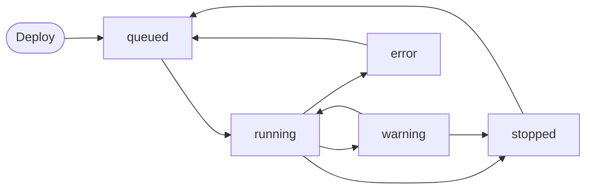

# What are agents in Nora?

> Learn what an agent is in Nora — a deployed runtime inside an isolated container — and understand its lifecycle statuses, resources, and available actions.

An agent in Nora is a deployed runtime instance running inside an isolated container. When you deploy an agent, Nora provisions a sandboxed environment with the resources you specify — vCPU, RAM, and disk — and manages that container through its full lifecycle from the dashboard. You interact with a running agent through its gateway (a browser-accessible control UI), a terminal session, chat, and logs, all from a single surface.

## Agent lifecycle

Every agent moves through a defined set of states from the moment you deploy it until it is stopped or removed. Understanding these states helps you know what Nora is doing at any point and how to respond when something needs attention.

### Agent statuses

| Status    | What it means                                                                                                            |
| --------- | ------------------------------------------------------------------------------------------------------------------------ |
| `queued`  | The agent has been accepted and is waiting for a deployment job to start the container.                                  |
| `running` | The container is live, the runtime is active, and the agent is ready to accept requests.                                 |
| `stopped` | The agent has been intentionally stopped. The container exists but is not running. You can start it again.               |
| `warning` | The agent is in a degraded state — the container may be unresponsive or experiencing issues — but has not fully stopped. |
| `error`   | Deployment or runtime failed. The agent cannot be started in its current state. Redeploy to recover.                     |

<Note>
  Nora reconciles agent status in real time when you open an agent detail page. If the actual
  container state has changed since the last recorded status, Nora updates the status automatically.
</Note>

## Agent resources

When you deploy an agent in self-hosted mode, you choose the resource allocation within the limits your operator has configured:

| Resource | What it controls                                            |
| -------- | ----------------------------------------------------------- |
| **vCPU** | Number of virtual CPU cores assigned to the agent container |
| **RAM**  | Memory limit in megabytes (minimum 512 MB)                  |
| **Disk** | Persistent storage in gigabytes allocated to the container  |

<Tip>
  You can monitor live CPU usage and memory utilization from the agent detail page after the agent
  is running. Network I/O and disk throughput are shown only for execution targets that expose those
  counters, such as Docker and Proxmox.
</Tip>

## Gateway

The gateway is the control UI for your running agent runtime. Once an agent reaches `running` status, Nora exposes a gateway URL that opens the agent's interface directly in your browser. The gateway is only available while the agent is running — attempting to access it in any other state returns an error.

## Terminal

Every running agent provides an interactive terminal session connected directly to the agent container. You can open the terminal from the agent detail page to inspect the runtime environment, run commands, or debug issues without leaving the Nora dashboard.

<Warning>
  The terminal gives you direct shell access to your agent's container. Changes made through the
  terminal affect the live runtime environment.
</Warning>

## Agent lifecycle actions

<AccordionGroup>
  <Accordion title="Start">
    Starts a stopped agent container. The agent must have an existing container — if it was never deployed or the container was destroyed, you need to deploy it again.
  </Accordion>

<Accordion title="Stop">
  Gracefully stops the running container and sets the agent status to `stopped`. The agent record
  and its configuration are preserved.
</Accordion>

<Accordion title="Restart">
  Stops and immediately restarts the agent container. The agent returns to `running` status when the
  container comes back up.
</Accordion>

<Accordion title="Redeploy">
  Available when an agent is in `warning`, `error`, or `stopped` state. Re-queues the agent for a
  fresh deployment using the same name, sandbox type, and resource specs. Use this to recover from
  failed deployments.
</Accordion>

  <Accordion title="Delete">
    Permanently removes the agent and destroys its container. This action cannot be undone.
  </Accordion>
</AccordionGroup>

## Related concepts

<CardGroup cols={2}>
  <Card title="Agent runtimes" icon="box" href="/concepts/runtimes">
    Learn about OpenClaw and NemoClaw sandbox types.
  </Card>

  <Card title="Workspaces" icon="folders" href="/concepts/workspaces">
    Group and organize agents with workspaces.
  </Card>
</CardGroup>
