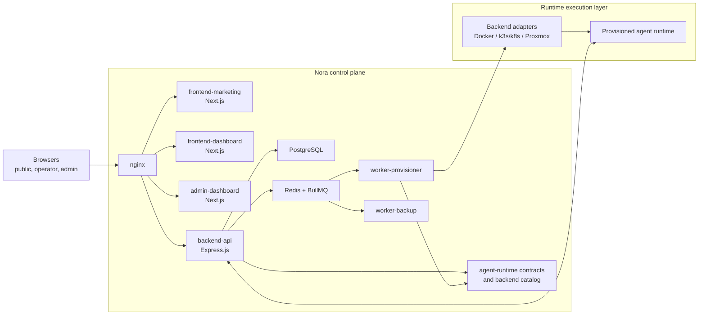
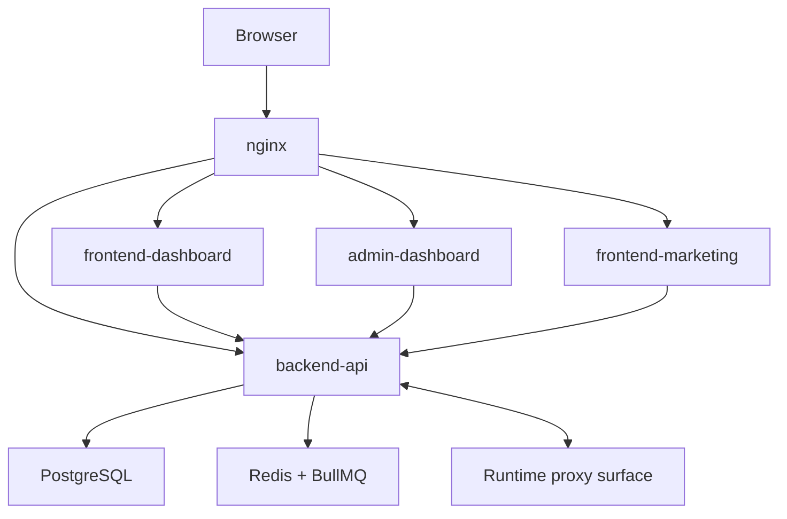
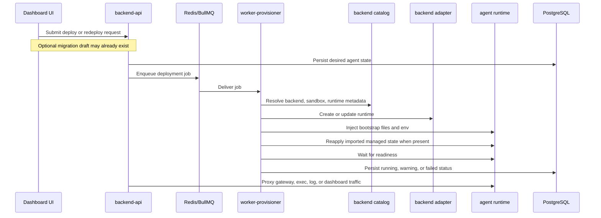

# Architecture

> Canonical public overview of how Nora's control plane is wired together — frontends, API, queues, workers, backend adapters, and the runtime contract package.

Nora is the self-hosted AI agent ops platform — an operator-facing control plane for OpenClaw, Hermes, and supported sandboxed runtimes. Three browser surfaces sit behind one nginx ingress, platform state lives in PostgreSQL, background work is coordinated through Redis and BullMQ, and runtimes are provisioned (or proxied) through backend adapters that share the runtime contract package in `agent-runtime/`.

The public repo centers on a single control-plane host. Agent workloads can stay on the local Docker host or be placed onto supported external execution targets — Kubernetes (k3s/k8s), Proxmox, NemoClaw — without changing the operator workflow.

## System map

## Major components

| Component                | Repo surface                                | Role                                                                                                                                                                              |
| ------------------------ | ------------------------------------------- | --------------------------------------------------------------------------------------------------------------------------------------------------------------------------------- |
| Public and auth UI       | `frontend-marketing/`                       | Landing pages, signup, login, and public entrypoint routes.                                                                                                                       |
| Operator workspace       | `frontend-dashboard/`                       | Deployments, migration/import, fleet operations, filesystem access, logs, settings, Agent Hub, alert rules, backups, and runtime interaction surfaces.                            |
| Admin workspace          | `admin-dashboard/`                          | Fleet-wide administration, moderation, audit, platform settings, release upgrades.                                                                                                |
| Reverse proxy            | `nginx.conf`, `nginx.public.conf`, `infra/` | Routes browser traffic to the correct UI or API surface and carries WebSocket / SSE traffic.                                                                                      |
| Control-plane API        | `backend-api/`                              | Auth, persistence, workspace RBAC, API keys, queue orchestration, monitoring, alert rules, Agent Hub logic, runtime coordination, and runtime proxy endpoints.                    |
| Durable state            | PostgreSQL 15                               | Accounts, agents, workspaces, members, invitations, API keys, deployments, migration drafts, snapshots, Agent Hub content, integrations, channels, metrics, events, alert rules. |
| Queue and worker handoff | Redis 7 + BullMQ                            | Carries deployment, ClawHub-install, backup, and alert-delivery jobs between the API and workers.                                                                                 |
| Provisioning worker      | `workers/provisioner/`                      | Resolves backend choice, injects bootstrap state, applies imported managed state, waits for readiness, persists status. Also runs the ClawHub-install and alert-delivery workers. |
| Backup worker            | `workers/backup/`                           | Captures encrypted backup archives, runs scheduled backups, prunes expired backups.                                                                                               |
| Runtime contract package | `agent-runtime/`                            | Shared runtime-side files, ports, endpoint conventions, bootstrap helpers, and backend metadata used by the API and worker.                                                       |

## Control plane

### Request routing

WebSocket upgrades are handled at the nginx layer; the Express app attaches WS handlers via `attachGatewayWS`. SSE chat endpoints (`/api/agents/*/gateway/chat`) have chunked transfer encoding disabled for real-time streaming. OAuth callbacks land at the marketing app before redirecting into backend-issued HttpOnly session cookies.

### API responsibilities

`backend-api/server.ts` is the control-plane integration hub. It wires together:

- Security middleware: helmet, CORS, rate limiting, correlation IDs, prototype-pollution-safe input validation
- Auth middleware (session JWT + workspace-scoped API key bearer auth)
- Workspace-scoped route families for agents, alert rules, API keys, channels, integrations, LLM providers, monitoring, Agent Hub, and workspace members
- Admin-only routes for fleet operations, audit, moderation, release upgrades, and platform settings
- Gateway proxy with SSRF guards (`gatewayProxy.ts` — exposes `createGatewayRouter` + `attachGatewayWS`)
- Background telemetry (`backgroundTasks.ts`, `scheduler.ts`) and release-availability checks (`releaseInfo.ts`)

### State and queue boundaries

| Service          | What it stores or carries                                                                                                                                                                                                           |
| ---------------- | ----------------------------------------------------------------------------------------------------------------------------------------------------------------------------------------------------------------------------------- |
| PostgreSQL       | Users, workspaces, workspace_members (RBAC), invitations, API keys (HMAC-hashed), agents, agent_versions, deployments, migration drafts, snapshots, Agent Hub listings/versions/reports, alert rules, backups, integrations, events. |
| Redis + BullMQ   | Four queues: `deployments`, `clawhub-installs`, `backups`, `alert-deliveries`. Each has its own retry, backoff, and DLQ retention configured in `backend-api/redisQueue.ts`.                                                         |

The API persists desired state first, then hands long-running work to a queue-backed worker. That keeps provisioning failures, retries, and delayed readiness out of the synchronous browser request path.

### Workspace RBAC

Every meaningful resource — agents, alert rules, API keys, Agent Hub listings, backups — is scoped to a workspace. A workspace has a creator (`workspaces.user_id`) plus a row per member in `workspace_members` with one of four roles:

| Role     | Can read | Can edit | Can manage members | Can delete workspace |
| -------- | -------- | -------- | ------------------ | -------------------- |
| `viewer` | ✅       | ❌       | ❌                 | ❌                   |
| `editor` | ✅       | ✅       | ❌                 | ❌                   |
| `admin`  | ✅       | ✅       | ✅                 | ❌                   |
| `owner`  | ✅       | ✅       | ✅                 | ✅                   |

Permission checks read from `workspace_members.role`, never from `workspaces.user_id` directly. Invitations land in `workspace_invitations` with a hashed token signed by `NORA_WORKSPACE_INVITE_SECRET` (falls back to `JWT_SECRET`).

### API keys and bearer auth

Each workspace can mint scoped API keys (`/app/workspaces/:id/api-keys`). Tokens are bearer-only, prefixed `nora_`, hashed at rest with HMAC-SHA256, and carry a fixed scope set: `agents:read`, `agents:write`, `workspaces:read`, `monitoring:read`, `integrations:read`, `integrations:write`. Workspace mutation, member management, and key issuance stay on session auth — an API key cannot mint another key.

## Migration and filesystem contract

### Migration flow

Nora ships a control-plane-managed migration path for both `openclaw` and `hermes`:

1. The operator prepares a migration draft from one of:
   - An uploaded Nora migration bundle or legacy OpenClaw template JSON
   - A live Docker source
   - A live SSH source
2. `backend-api/agentMigrations.ts` normalizes the imported data and stores an encrypted manifest in PostgreSQL.
3. The operator deploys a new Nora-managed agent using that draft.
4. The provisioning worker recreates the runtime under Nora control instead of adopting the original runtime in place.

Nora does not bind to the legacy runtime as-is. It uses the draft as desired state for a fresh Nora-managed deployment.

### Import surface

The current public import contract is intentionally scoped:

- `openclaw`: agent files, workspace content, session memory, and provider material Nora can extract from supported source files
- `hermes`: workspace content, model config, supported Hermes channel config, and provider environment material
- Both families: supported Nora-managed state such as imported provider records, channel/integration wiring where available, and per-agent secret overrides

Unsupported runtime-specific state is surfaced as draft warnings instead of being silently invented or applied.

### Export and live files

- Nora-managed agents can be exported as `nora-migration-bundle/v1` bundles for recreation on another Nora control plane.
- The agent detail Files tab reads the actual runtime filesystem through `backend-api/agentFiles.ts`.
- Filesystem access is root-allowlisted: a writable workspace root and curated read-only system roots for inspection and download.
- The browser never receives arbitrary host filesystem access; reads and writes are mediated through runtime-aware backend commands.

## Runtime provisioning

### Selection model

Nora chooses a concrete backend through three layers of intent:

| Layer           | Current values                | Meaning                                                                                                                  |
| --------------- | ----------------------------- | ------------------------------------------------------------------------------------------------------------------------ |
| Runtime family  | `openclaw`, `hermes`          | Which operator contract the runtime satisfies.                                                                           |
| Deploy target   | `docker`, `k8s`, `proxmox`    | Where the runtime should be scheduled. `k3s` is accepted as a user-facing id and normalizes to `k8s` internally.         |
| Sandbox profile | `standard`, `nemoclaw`        | Which isolation profile should wrap the runtime.                                                                         |

The worker resolves the final backend through shared metadata in `agent-runtime/lib/backendCatalog.ts`. See [Provisioner backends](/configuration/provisioner-backends) for the supported combinations and their maturity.

### Provisioning lifecycle

### Bootstrap contract

The worker and backend adapters share one runtime bootstrap package from `agent-runtime/`:

- Runtime library files are injected into the launched environment.
- Template payload files are copied into the runtime workspace when present.
- Runtime environment variables are assembled centrally.
- Endpoint conventions stay shared across the worker and API.

Shared ports:

| Port    | Purpose                                       |
| ------- | --------------------------------------------- |
| `9090`  | Nora runtime-side HTTP contract               |
| `18789` | OpenClaw gateway port                         |
| `9119`  | Hermes dashboard port                         |

### Backend adapter code sharing

Compose mounts `./workers/provisioner/backends` into `backend-api` at `/app/backends`. Adapter code is **physically shared** between the API and the provisioner worker. When editing adapters, verify both consumers still work.

## Background work

| Queue              | Job type        | Concurrency                          | Retry                                 | Worker                          | What it does                                                                            |
| ------------------ | --------------- | ------------------------------------ | ------------------------------------- | ------------------------------- | --------------------------------------------------------------------------------------- |
| `deployments`      | `deploy-agent`  | `DEPLOYMENT_WORKER_CONCURRENCY` (6)  | 5 attempts, exponential 3 s base      | `workers/provisioner/worker.ts` | Provisions or redeploys an agent runtime through the chosen backend adapter.            |
| `clawhub-installs` | `install-skill` | 1                                    | 1 attempt (operator drives retries)   | `workers/provisioner/worker.ts` | Runs `clawhub install` inside an OpenClaw agent and persists the installed-skill state. |
| `backups`          | `run-backup`    | `BACKUP_WORKER_CONCURRENCY` (2)      | 2 attempts, exponential 5 s base      | `workers/backup/worker.ts`      | Captures, encrypts, and uploads an agent backup archive, then prunes expired backups.   |
| `alert-deliveries` | `deliver-webhook` | `ALERT_DELIVERY_WORKER_CONCURRENCY` (5) | `ALERT_DELIVERY_ATTEMPTS` (5), exponential 1 s base | `workers/provisioner/worker.ts` | Posts a webhook delivery for an alert rule. Each job is one (rule, channel) pair.       |

Failed jobs are retained on each queue for inspection. The DLQ surface for deployments is exposed via `getDLQJobs` / `retryDLQJob` in `backend-api/redisQueue.ts`.

## Trust boundaries

- Browsers never talk directly to PostgreSQL or Redis. All browser traffic enters through nginx and reaches stateful services through the frontends or `backend-api/`.
- `backend-api/` owns auth, persistence, queue orchestration, release metadata, and runtime-facing proxy routes. Frontends do not provision runtimes directly.
- `backend-api/` also owns migration draft inspection/storage and all runtime file access mediation. Browser users do not receive direct host or container filesystem access.
- `workers/provisioner/` and `workers/backup/` handle long-running infrastructure work outside the request path. They consume queued jobs and write the result back into control-plane state.
- `agent-runtime/` defines the runtime-side contract used after launch. Control-plane code depends on that contract rather than embedding backend-specific assumptions everywhere.
- External execution systems such as Docker, Kubernetes, Proxmox, and NVIDIA secure sandboxes are reached through backend adapters instead of directly from browser surfaces.
- Stored secrets — provider keys, integration credentials, OAuth tokens, backup encryption material, SMTP password — are AES-256-GCM encrypted with `ENCRYPTION_KEY`. API keys and Agent Hub installation keys are HMAC-hashed at rest, not encrypted.

## Deployment topologies

| Topology                                 | Ingress owner                                         | Control plane placement | Agent placement                                       | Best fit                                                                       |
| ---------------------------------------- | ----------------------------------------------------- | ----------------------- | ----------------------------------------------------- | ------------------------------------------------------------------------------ |
| Local single-host                        | Nora nginx on `NGINX_HTTP_PORT`                       | One Docker Compose host | Local Docker by default                               | Evaluation, local proof, small self-hosted installs                            |
| Public domain, Nora-managed ingress      | Nora nginx on public ports                            | One Docker Compose host | Local Docker or supported external targets            | Straightforward public self-hosting                                            |
| Public domain behind external proxy      | Host or upstream proxy terminates and forwards        | One Docker Compose host | Local Docker or supported external targets            | Existing nginx, Cloudflare, or host-managed TLS setups                         |
| External runtime targets                 | Same ingress as above                                 | One Docker Compose host | Kubernetes (k3s/k8s), Proxmox, NemoClaw sandboxes     | Teams that need different runtime placement without changing operator workflow |

The clearest public path today is one host running the control plane, with agent runtimes launched locally through Docker by default. Public-domain setups can either let Nora own public ingress directly or put an external reverse proxy in front of Nora's internal nginx.

## Current constraints

- The public OSS path is primarily a single-host control plane. The repo does not currently claim a first-class HA or distributed control-plane deployment story.
- OpenClaw is the default runtime family. Hermes is a narrower, deployment-first runtime path with a different operator contract.
- Migration recreates runtimes under Nora control; it does not adopt a legacy runtime in place.
- Hermes is a runtime family, not a backend id. Docker and Proxmox are the current Hermes execution targets, and Hermes import applies only the supported Nora-managed/runtime state described above.
- Kubernetes (k3s/k8s), Proxmox, and NemoClaw are execution-target options for agents, not separate control-plane products.

## Related

<CardGroup cols={2}>
  <Card title="Provisioner backends" icon="server" href="/configuration/provisioner-backends">
    Supported deploy targets, their maturity, and required configuration.
  </Card>

  <Card title="Environment variables" icon="sliders" href="/configuration/environment-variables">
    Every variable Nora reads, grouped by subsystem.
  </Card>

  <Card title="Workspaces" icon="folders" href="/concepts/workspaces">
    Workspace ownership, RBAC roles, and member invitations.
  </Card>

  <Card title="Agent Hub" icon="store" href="/concepts/agent-hub">
    Listing types, share targets, version model, source-catalog API keys.
  </Card>
</CardGroup>
